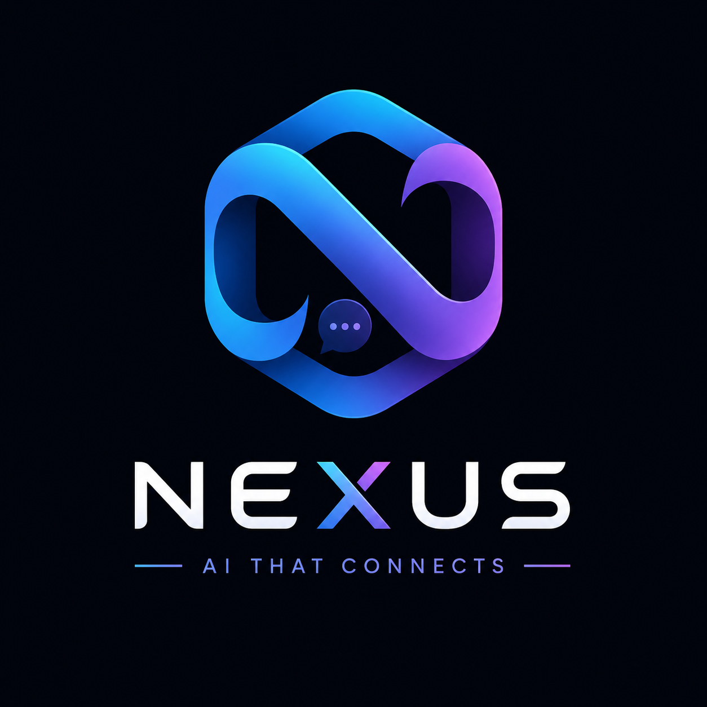

<div align="center">



# NEXUS AI

**One AI. Infinite connections.**

A full-stack AI super app — 13 abilities, 27 live connectors, a real code sandbox, AI video generation, and a real email agent.

</div>

## ✨ Abilities

| | | |
|---|---|---|
| 💬 **AI Chat** — deep thinking mode, Markdown answers | 🎙️ **Live Voice** — real-time conversation in 12 languages | 🤖 **Agent** — autonomous tool-calling with 27 connectors |
| 💻 **Code Studio** — real sandbox (JS/TS/Python) + AI assist | 🎬 **Video Studio** — AI-directed MP4s with narration | 🎨 **Image Studio** — dual providers |
| 📄 **Office Studio** — real Word/Excel/PowerPoint with premium templates | 👁️ **Vision** — image understanding | 🔍 **Web Search** — live results + AI digest |
| 📖 **Page Reader** — clean extraction | 🗣️ **Voice Studio** — 40+ neural voices, TTS + ASR | 🧠 **AI Models** — bring your own free API keys |

## 🔌 27 Live Connectors

**Web & Data**: Web Search · Read Page · Weather · Forecast · Rocket Launches · World News (BBC) · Steam Games
**Knowledge**: Wikipedia · Dictionary · Translator · arXiv · NASA · Recipes · Pokédex · Trivia
**Finance**: Crypto (Coinbase) · Currency Rates
**Developer**: GitHub · Hacker News
**Utility**: Calculator · Time · Geocoder · Image Generation
**Email (real)**: Inbox list · Search · Read · Send — via your own IMAP/SMTP account

## 🏗️ Tech Stack

- **Next.js 16** (App Router) + **TypeScript** — the live app is the unified
  "NEXUS One" chat in `src/components/nexus` (the older per-ability UIs were
  removed from the repo)
- **shadcn/ui** semantic design system — Claude-inspired warm ivory theme
- **Prisma** — SQLite in local dev, Supabase Postgres in production
  (provider is switched automatically at build time from `DATABASE_URL`)
- 13 models: sessions, messages, images, videos, documents, users, email
  accounts, AI providers, memories, projects, files, WhatsApp accounts
- **Real execution**: Bun/CPython sandbox with timeouts and process-group
  kills, ffmpeg video pipeline
- **Security**: AES-256-GCM encrypted credentials (fail-fast secrets in
  production), CSRF Origin guard, per-IP rate limiting, zod validation,
  SSRF-guarded outbound fetches, signed WhatsApp webhooks, sign-in-gated
  command sandbox

## 🚀 Getting Started

```bash
bun install
bun run db:push     # create the SQLite schema
bun run dev         # start on :3000
```

Optional — plug in free AI provider keys in **AI Models** (OpenRouter, Groq, Gemini, Mistral, Cerebras, Together) and connect your email in **Connectors**.

## 📁 Structure

```
src/
├── app/            # API routes (chat, agent, code, video, office, email, tts…) + page.tsx
├── components/     # nexus = live UI; omni = WhatsApp/skills/markdown/voice modules; ui = shadcn kit
└── lib/            # connectors registry, email (IMAP/SMTP), AI providers, sandbox helpers
prisma/             # schema (13 models — see Tech Stack)
data/agency/        # persona prompts read at runtime (Agency feature)
cli-anything/       # vendored skill catalog read at runtime (Skills feature)
```

---

Built with Z.ai frontier models. Generated content stays local; credentials are encrypted at rest.

> **Deploying?** See `DEPLOYMENT.md` (authoritative, full env var list and
> troubleshooting) — `DEPLOY.md` is the quick-start summary.
